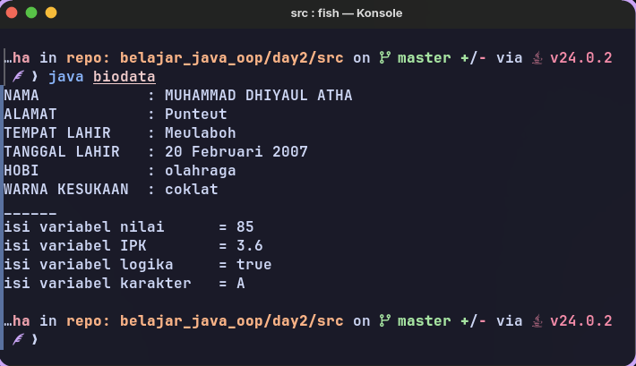
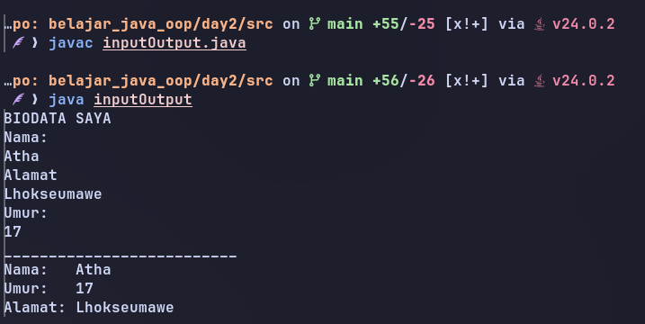

# Day 2 – Java OOP Dasar

## Materi
1. Input & Output sederhana  
2. Percobaan dengan beberapa class (`Biodata`, `Percobaan`, `InputOutput`)  
3. Latihan struktur program Java

## Hasil
Berikut cuplikan salah satu hasil running:

,