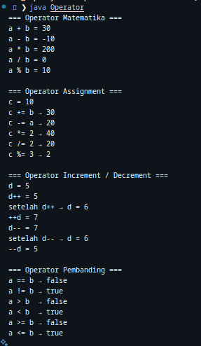
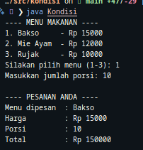

# Belajar Java OOP - DAY 3

## 📚 Materi yang Dipelajari Hari Ini
Pada day ke-3 ini, saya mempelajari dasar-dasar **operator** dan **kondisi** dalam bahasa Java.  
Beberapa hal penting yang saya pelajari hari ini adalah:

1. **Operator di Java**
   - **Operator Aritmatika**: `+`, `-`, `*`, `/`, `%`
   - **Operator Assignment**: `=`, `+=`, `-=`, `*=`, `/=`, `%=`
   - **Operator Increment/Decrement**: `++` (pre/post), `--` (pre/post)
   - **Operator Pembanding**: `==`, `!=`, `>`, `<`, `>=`, `<=`

**hasil**

2. **Kondisi (if-else)**
   - Membuat logika percabangan sederhana dengan `if`, `else if`, dan `else`
   - Digunakan untuk menentukan aksi berdasarkan pilihan user

**hasil**

   